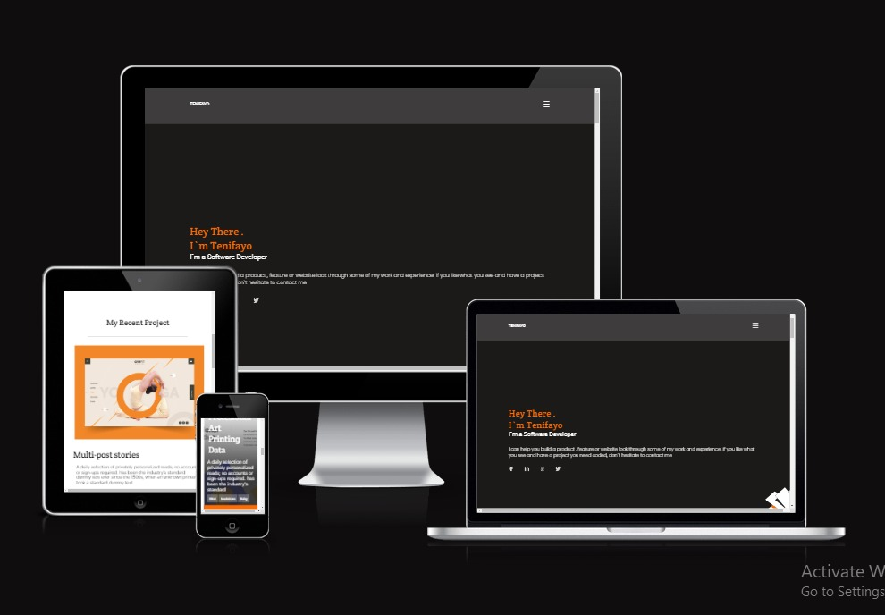

# Portfolio project

> Portfolio website is one of the most powerful tools in software developer toolbox; it’s the easiest way of showing what truly capable of as a developer, and is a quick and simple way for recruiters and hiring managers to get an idea of what someone can bring to their teams .



## Built With

- HTML5 form elements
  - `Section`, `nav`, `ul` h3.
- CSS properties
  - `background-color`, `display`, `justify-content`, `flex-direction` `Visibility`.
- Linters
  - [Prettier](https://prettier.io/),
  - [Stylelint](https://stylelint.io/).
- GitHub Action

## Built With

- HTML semantic elements : input , div , img and ul etc .
- CSS elements : display flex , display grid , grid-template etc .
- Reamdme

## Live Demo

[Live Demo Link](https://https://tenifayo-portfolio-project.netlify.app/)

### Development (Running locally)

- Clone the project

```bash
git clone git@github.com:abdulsomod1/portfolio-project.git.

```

- Install Dependencies

```bash
yarn install
```

To run StyleLint by itself, you may run the lint task:

```bash
yarn stylelint:check
```

Or to automatically fix issues found for StyleLint (where possible):

```bash
yarn stylelint
```

To run ESLint by itself, you may run the lint task:

```bash
yarn eslint:check
```

Or to automatically fix issues found for ESLint (where possible):

```bash
yarn eslint
```

You can also check against Prettier:

```bash
yarn format:check
```

and to have it fix (to the best of its ability) any format issues, run:

```bash
yarn format
```

You can also check against HTML Validator (htmlhint):

```bash
yarn lint:html
```

To generate an accessibility report for this webpage, run the below command, it uses axe:

```bash
yarn axe
```

## Style Guides

- [CSS Style Guide](http://udacity.github.io/frontend-nanodegree-styleguide/css.html)
- [HTML Style Guide](http://udacity.github.io/frontend-nanodegree-styleguide/index.html)
- [JavaScript Style Guide](http://udacity.github.io/frontend-nanodegree-styleguide/javascript.html)
- [Git Style Guide](https://udacity.github.io/git-styleguide/)
- [AXE Accessibility Style Guide](https://dequeuniversity.com/rules/axe/html/4.7)

## 👤 Author

- Github: [@author](https://github.com/abdulsomod1)
- Twitter: [@author](https://twitter.com/codingcoding1)
- Linkedin: [@author](https://www.linkedin.com/in/abdulsomod1/)

## 🤝 Contributing

Contributions, issues and feature requests are welcome!

Feel free to check the [issues page](../../issues).

## Show your support

Give a ⭐️ if you like this project!

## Acknowledgments

- Hat tip to anyone whose code was used
- Inspiration, resources/assets used
- etc

## 📝 License

[MIT licensed](./LICENSE).
